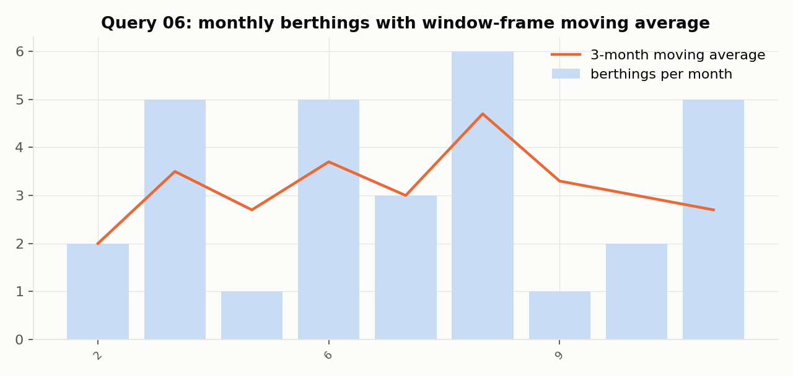
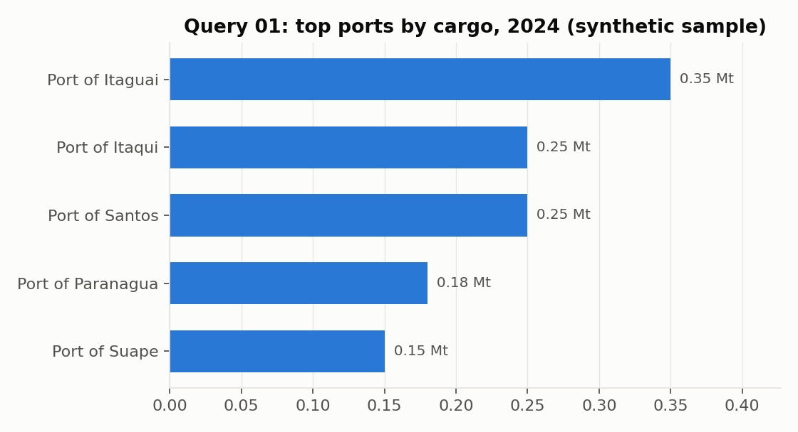

# antaq-port-sql

**Reproducible DuckDB star-schema warehouse of Brazilian port operations, mirroring the ANTAQ open microdata, with documented SQL queries that reproduce port-sector indicators**

[](https://doi.org/10.5281/zenodo.20709577)
[](LICENSE)
[](https://www.python.org)
[](https://duckdb.org)

<p align="center">
  
</p>

## What this is

A small, fully reproducible star-schema warehouse of Brazilian port operations (berthings and cargo movements) with a library of documented SQL queries. It mirrors the structure of the **ANTAQ Estatístico Aquaviário** open microdata and operationalises a subset of the indicators used in national port statistics: movements, average berthing times, year-over-year growth, cargo-nature mix and seasonality.

The repository ships with a **synthetic sample** so that everything runs out of the box; the same schema and queries work on the real ANTAQ extracts.

## Data model

```
dim_porto ──┐
            ├── fato_atracacao ── fato_movimentacao
dim_navio ──┘
```

| Table | Grain | Key columns |
|---|---|---|
| `dim_porto` | one row per port or terminal | port_id, port_name, state, port_type |
| `dim_navio` | one row per vessel | vessel_id, imo, vessel_type, dwt |
| `fato_atracacao` | one row per berthing | berthing_id, port_id, vessel_id, berth_hours, berth_year |
| `fato_movimentacao` | one row per cargo movement | movement_id, berthing_id, cargo_nature, tonnes, direction |

## Indicators implemented

| Query | Indicator | SQL technique |
|---|---|---|
| `01_top_ports_by_cargo.sql` | Top ports by cargo (2024) | JOIN, GROUP BY, ORDER BY, LIMIT |
| `02_avg_berth_time.sql` | Average berthing time by port and year | AVG, GROUP BY |
| `03_yoy_growth.sql` | Year-over-year cargo growth | CTE + LAG() window |
| `04_cargo_nature_mix.sql` | Cargo nature mix per port | Conditional aggregation (CASE) |
| `05_rank_within_vessel_type.sql` | Port ranking within vessel type | RANK() window |
| `06_monthly_seasonality.sql` | Monthly berthings and 3-month moving average | Window frame (ROWS BETWEEN) |

## Gallery

| Query 01: top ports by cargo | Query 06: seasonality with a window frame |
|---|---|
|  |  |

Both figures come from the synthetic sample and illustrate the query output, not real port statistics.

## Reproducing

```bash
pip install -r requirements.txt
python load.py            # builds antaq.duckdb from data/sample
python run_queries.py     # runs every query and prints the results
```

Or interactively in `notebooks/01_explore.ipynb`. To rebuild from scratch, delete `antaq.duckdb` first (the loader inserts into tables with primary keys).

### Using real ANTAQ data

1. Download the *Estatístico Aquaviário* base from <https://web3.antaq.gov.br/ea/sense/download.html>.
2. Map its fields to the expected columns (berthing dates, port, vessel, cargo nature, tonnes, direction). The sample CSVs document the target shape.
3. Run `python load.py --data path/to/your/csvs`.

## Repository map

| Path | Content |
|---|---|
| `schema.sql` | DDL: dimensions and facts |
| `load.py` | ETL: CSV to DuckDB star schema |
| `run_queries.py` | Runs all queries |
| `queries/` | One documented `.sql` file per indicator |
| `data/sample/` | Synthetic sample (ports, vessels, berthings, cargo) |
| `notebooks/` | Interactive exploration |
| `docs/gallery/` | Figures used in this README |

## Related projects

- [Brazil_Vessel_Call_Intelligence](https://github.com/darlianecunha/Brazil_Vessel_Call_Intelligence): 30,972 real port calls at three Brazilian ports, with IMO-based emissions
- [brazilportdata](https://github.com/darlianecunha/brazilportdata): research hub for the Brazilian port sector at [brazilportdata.com](https://www.brazilportdata.com)

## How to cite

Metadata in [`CITATION.cff`](CITATION.cff).

> Cunha, D. R. (2026). *antaq-port-sql: a reproducible SQL warehouse of Brazilian port operations* (Version 1.0) [Software]. Zenodo. https://doi.org/10.5281/zenodo.20709577

## Author and licence

**Darliane Ribeiro Cunha, PhD**. [ribeirocunha.com](https://ribeirocunha.com) · [ORCID 0000-0003-2548-1237](https://orcid.org/0000-0003-2548-1237)

Code: [MIT](LICENSE). Sample data is synthetic and for demonstration only; real figures must come from ANTAQ open data under its own terms. Cargo-nature labels follow ANTAQ conventions (granel sólido, granel líquido, conteinerizada, carga geral).
